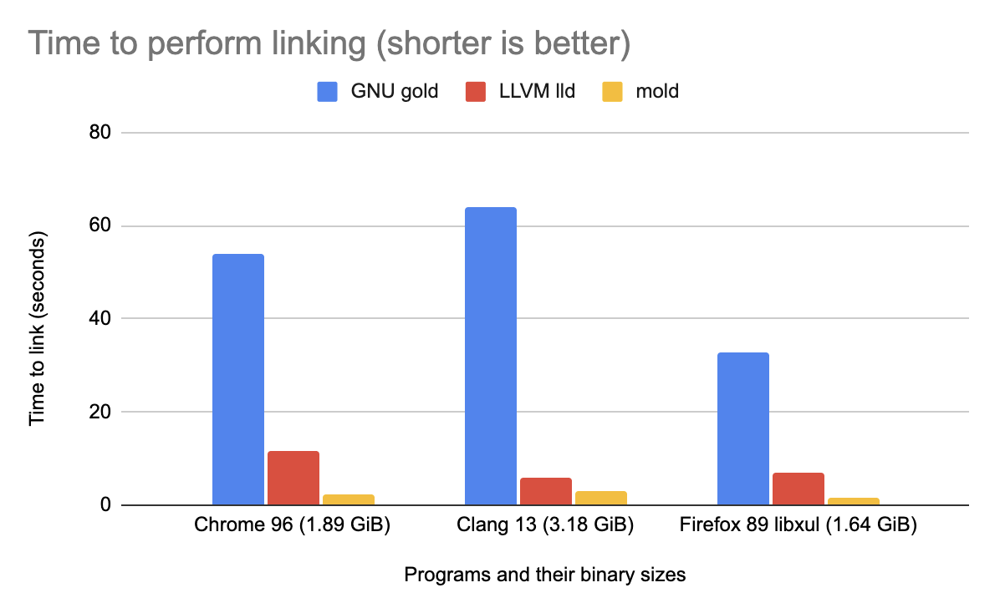
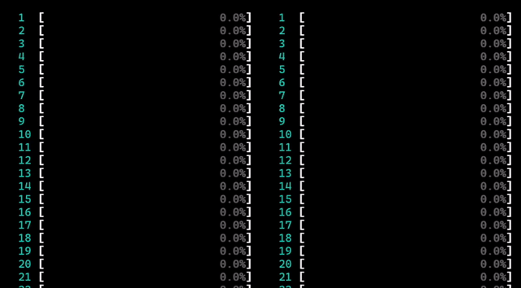

# mold: A Modern Linker

[](https://github.com/rui314/mold/actions/workflows/ci.yml)

<i>This repository contains a free version of the mold linker.
If you are looking for a commercial version that supports macOS
please visit the
[repository of the sold linker](https://github.com/bluewhalesystems/sold).</i>

mold is a faster drop-in replacement for existing Unix linkers. It is several
times quicker than the LLVM lld linker, the second-fastest open-source linker,
which I initially developed a few years ago. mold aims to enhance developer
productivity by minimizing build time, particularly in rapid
debug-edit-rebuild cycles.

Here is a performance comparison of GNU gold, LLVM lld, and mold when linking
final debuginfo-enabled executables for major large programs on a simulated
8-core, 16-thread machine.



| Program (linker output size)  | GNU gold | LLVM lld | mold
|-------------------------------|----------|----------|--------
| Chrome 96 (1.89 GiB)          | 53.86s   | 11.74s   | 2.21s
| Clang 13 (3.18 GiB)           | 64.12s   | 5.82s    | 2.90s
| Firefox 89 libxul (1.64 GiB)  | 32.95s   | 6.80s    | 1.42s

mold is so fast that it is only 2x _slower_ than the `cp` command on the same
machine. If you find that mold is not faster than other linkers, please feel
free to [file a bug report](https://github.com/rui314/mold/issues).

mold supports x86-64, i386, ARM64, ARM32, 64-bit/32-bit little/big-endian
RISC-V, 32-bit PowerPC, 64-bit big-endian PowerPC ELFv1, 64-bit little-endian
PowerPC ELFv2, s390x, 64-bit/32-bit LoongArch, SPARC64, m68k, SH-4, and DEC
Alpha.

mold/macOS is commercial software. For mold/macOS, please visit
https://github.com/bluewhalesystems/sold.

## Why does linking speed matter?

If you are using a compiled language such as C, C++, or Rust, a build consists
of two phases. In the first phase, a compiler compiles source files into
object files (`.o` files). In the second phase, a linker takes all object
files and combines them into a single executable or shared library file.

The second phase can be time-consuming if your build output is large. mold can
speed up this process, saving you time and preventing distractions while
waiting for a lengthy build to finish. The difference is most noticeable
during rapid debug-edit-rebuild cycles.

## Installation

Binary packages for the following systems are currently available:

[](https://repology.org/project/mold/versions)

## How to Build

mold is written in C++20, so if you build mold yourself, you will need a
recent version of a C++ compiler and a C++ standard library. We recommend GCC
10.2 or Clang 12.0.0 (or later) and libstdc++ 10 or libc++ 7 (or later).

### Install Dependencies

To install build dependencies, run `./install-build-deps.sh` in this
directory. It will detect your Linux distribution and attempt to install the
necessary packages. You may need to run it as root.

### Compile mold

```shell
git clone https://github.com/rui314/mold.git
mkdir mold/build
cd mold/build
git checkout v2.1.0
../install-build-deps.sh
cmake -DCMAKE_BUILD_TYPE=Release -DCMAKE_CXX_COMPILER=c++ ..
cmake --build . -j $(nproc)
sudo cmake --install .
```

You might need to pass a C++20 compiler command name to `cmake`. In the
example above, `c++` is passed. If that doesn't work for you, try a specific
version of a compiler, such as `g++-10` or `clang++-12`.

By default, `mold` is installed to `/usr/local/bin`. You can change the
installation location by passing `-DCMAKE_INSTALL_PREFIX=<directory>`.
For other cmake options, see the comments in `CMakeLists.txt`.

If you are not using a recent enough Linux distribution, or if `cmake` does
not work for you for any reason, you can use Docker to build mold in a Docker
environment. To do so, run `./dist.sh` in this directory instead of using
`cmake`. The shell script will pull a Docker image, build mold and auxiliary
files inside it, and package them into a single tar file named
`mold-$version-$arch-linux.tar.gz`. You can extract the tar file anywhere and
use the mold executable within it.

## How to use

<details><summary>A classic way to use mold</summary>

On Unix, the linker command (usually `/usr/bin/ld`) is indirectly invoked by
the compiler driver (typically `cc`, `gcc`, or `clang`), which is in turn
indirectly invoked by `make` or another build system command.

If you can specify an additional command line option for your compiler driver
by modifying the build system's config files, add one of the following flags
to use mold instead of `/usr/bin/ld`:

- For Clang: pass `-fuse-ld=mold`

- For GCC 12.1.0 or later: pass `-fuse-ld=mold`

- For GCC before 12.1.0: the `-fuse-ld` option does not accept `mold` as a
  valid argument, so you need to use the `-B` option instead. The `-B` option
  tells GCC where to look for external commands like `ld`.

  If you have installed mold with `make install`, there should be a directory
  named `/usr/libexec/mold` (or `/usr/local/libexec/mold`, depending on your
  `$PREFIX`), and the `ld` command should be there. The `ld` is actually a
  symlink to `mold`. So, all you need is to pass `-B/usr/libexec/mold` (or
  `-B/usr/local/libexec/mold`) to GCC.

If you haven't installed `ld.mold` to any `$PATH`, you can still pass
`-fuse-ld=/absolute/path/to/mold` to clang to use mold. However, GCC does not
accept an absolute path as an argument for `-fuse-ld`.

</details>

<details><summary>If you are using Rust</summary>

Create `.cargo/config.toml` in your project directory with the following:

```toml
[target.x86_64-unknown-linux-gnu]
linker = "clang"
rustflags = ["-C", "link-arg=-fuse-ld=/path/to/mold"]
```

where `/path/to/mold` is an absolute path to the mold executable. In the
example above, we use `clang` as a linker driver since it always accepts the
`-fuse-ld` option. If your GCC is recent enough to recognize the option, you
may be able to remove the `linker = "clang"` line.

```toml
[target.x86_64-unknown-linux-gnu]
rustflags = ["-C", "link-arg=-fuse-ld=/path/to/mold"]
```

If you want to use mold for all projects, add the above snippet to
`~/.cargo/config.toml`.

</details>

<details><summary>If you are using Nim</summary>

Create `config.nims` in your project directory with the following:

```nim
when findExe("mold").len > 0 and defined(linux):
  switch("passL", "-fuse-ld=mold")
```

where `mold` must be included in the `PATH` environment variable. In this
example, `gcc` is used as the linker driver. Use the `-fuse-ld` option if your
GCC is recent enough to recognize this option.

If you want to use mold for all projects, add the above snippet to
`~/.config/config.nims`.

</details>

<details><summary>mold -run</summary>

It is sometimes very hard to pass an appropriate command line option to `cc`
to specify an alternative linker. To address this situation, mold has a
feature to intercept all invocations of `ld`, `ld.lld`, or `ld.gold` and
redirect them to itself. To use this feature, run `make` (or another build
command) as a subcommand of mold as follows:

```shell
mold -run make <make-options-if-any>
```

Internally, mold invokes the given command with the `LD_PRELOAD` environment
variable set to its companion shared object file. The shared object file
intercepts all function calls to `exec(3)`-family functions to replace
`argv[0]` with `mold` if it is `ld`, `ld.gold`, or `ld.lld`.

</details>

<details><summary>GitHub Actions</summary>

You can use our [setup-mold](https://github.com/rui314/setup-mold) GitHub
Action to speed up GitHub-hosted continuous builds. Although GitHub Actions
run on a two-core machine, mold is still significantly faster than the default
GNU linker, especially when linking large programs.

</details>

<details><summary>Verify that you are using mold</summary>

mold leaves its identification string in the `.comment` section of an output
file. You can print it out to verify that you are actually using mold.

```shell
$ readelf -p .comment <executable-file>

String dump of section '.comment':
  [     0]  GCC: (Ubuntu 10.2.0-5ubuntu1~20.04) 10.2.0
  [    2b]  mold 9a1679b47d9b22012ec7dfbda97c8983956716f7
```

If `mold` is present in the `.comment` section, the file was created by mold.

</details>

<details><summary>Online manual</summary>

Since mold is a drop-in replacement, you should be able to use it without
reading its manual. However, if you need it, [mold's man page](docs/mold.md)
is available. You can read the same manual by running `man mold`.

</details>

## Why is mold so fast?

One reason is that it utilizes faster algorithms and more efficient data
structures compared to other linkers. Another reason is that mold is highly
parallelized.

Here is a side-by-side comparison of per-core CPU usage for lld (left) and
mold (right), linking the same program, a Chromium executable.



As you can see, mold uses all available cores throughout its execution and
finishes quickly. In contrast, lld fails to utilize available cores most of
the time. In this demo, the maximum parallelism is artificially capped at 16,
so that the bars fit in the GIF.

For details, please see the [design notes](docs/design.md).

## Sponsors

We accept donations via [GitHub Sponsors](https://github.com/sponsors/rui314)
and [OpenCollective](https://opencollective.com/mold-linker). We thank
everyone who sponsors our project. In particular, we'd like to acknowledge the
following people and organizations who have sponsored $128/month or more:

### Corporate sponsors

<a href="https://mercury.com"></a>

<a href="https://cybozu-global.com"></a>

<a href="https://www.emergetools.com"></a><br>

- [Uber](https://uber.com)
- [G-Research](https://www.gresearch.co.uk)
- [Signal Slot Inc.](https://github.com/signal-slot)

### Individual sponsors

- [300baud](https://github.com/300baud)
- [Johan Andersson](https://github.com/repi)
- [Wei Wu](https://github.com/lazyparser)
- [kyle-elliott](https://github.com/kyle-elliott)
