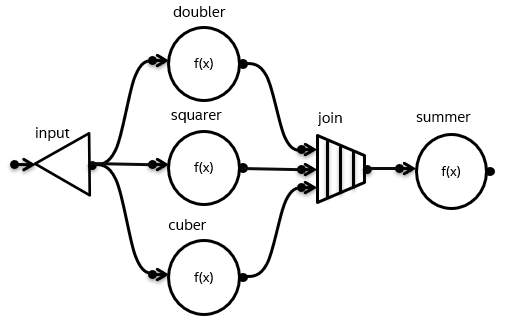

.. _helpers_for_expressing_graphs:

Helper Functions for Expressing Graphs
======================================

.. note::
   To enable this feature, define the ``TBB_PREVIEW_FLOW_GRAPH_FEATURES`` macro to 1.

Helper functions are intended to make creation of the flow graphs less verbose.

.. contents::
    :local:
    :depth: 1

Description
***********

This feature adds ``make_edges``, ``make_node_set``,
``follows`` and ``precedes`` functions to ``oneapi::tbb::flow`` namespace.
These functions simplify the process of building flow graphs by allowing to gather nodes
into sets and connect them to other nodes in the graph.

API
***

.. toctree::
    :titlesonly:

    constructors_for_nodes
    follows_and_precedes_functions
    make_node_set_function
    make_edges_function

Example
*******

Consider the graph depicted below.

In the examples below, C++17 Class Template Argument Deduction is used
to avoid template parameter specification where possible.

**Regular API**

.. code:: cpp

    #include <oneapi/tbb/flow_graph.h>

    int main() {
        using namespace oneapi::tbb::flow;

        graph g;

        broadcast_node<int> input(g);

        function_node doubler(g, unlimited,  { return 2 * v; });
        function_node squarer(g, unlimited,  { return v * v; });
        function_node cuber(g, unlimited,  { return v * v * v; });

        join_node<std::tuple<int, int, int>> join(g);

        int sum = 0;
        function_node summer(g, serial, [&](const std::tuple<int, int, int>& v) {
            int sub_sum = std::get<0>(v) + std::get<1>(v) + std::get<2>(v);
            sum += sub_sum;
            return sub_sum;
        });

        make_edge(input, doubler);
        make_edge(input, squarer);
        make_edge(input, cuber);
        make_edge(doubler, std::get<0>(join.input_ports()));
        make_edge(squarer, std::get<1>(join.input_ports()));
        make_edge(cuber, std::get<2>(join.input_ports()));
        make_edge(join, summer);

        for (int i = 1; i <= 10; ++i) {
            input.try_put(i);
        }
        g.wait_for_all();
    }

**Preview API**

.. code:: cpp

    #define TBB_PREVIEW_FLOW_GRAPH_FEATURES 1
    #include <oneapi/tbb/flow_graph.h>

    int main() {
        using namespace oneapi::tbb::flow;

        graph g;

        function_node doubler(g, unlimited,  { return 2 * v; });
        function_node squarer(g, unlimited,  { return v * v; });
        function_node cuber(g, unlimited,  { return v * v * v; });

        auto handlers = make_node_set(doubler, squarer, cuber);

        broadcast_node input(precedes(handlers));
        join_node join(follows(handlers));

        int sum = 0;
        function_node summer(follows(join), serial,
                             [&](const std::tuple<int, int, int>& v) {
                                 int sub_sum = std::get<0>(v) + std::get<1>(v) + std::get<2>(v);
                                 sum += sub_sum;
                                 return sub_sum;
                             });

        for (int i = 1; i <= 10; ++i) {
            input.try_put(i);
        }
        g.wait_for_all();
    }
