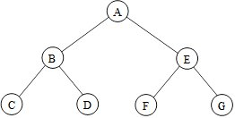

.. _Cancellation_and_Nested_Parallelism:

Cancellation and Nested Parallelism
===================================

The discussion so far was simplified by assuming non-nested parallelism
and skipping details of ``task_group_context``. This topic explains
both.

An |full_name| algorithm executes
by creating ``task`` objects that execute the snippets of code that you
supply to the algorithm template. By default, these ``task`` objects are
associated with a ``task_group_context`` created by the algorithm.
Nested oneTBB algorithms create a tree of these ``task_group_context``
objects. Cancelling a ``task_group_context`` cancels all of its child
``task_group_context`` objects, and transitively all its descendants.
Hence an algorithm and all algorithms it called can be cancelled with a
single request.

Exceptions propagate upwards. Cancellation propagates downwards. The
opposition interplays to cleanly stop a nested computation when an
exception occurs. For example, consider the tree in the following
figure. Imagine that each node represents an algorithm and its
``task_group_context``.

.. container:: fignone
   :name: fig6

   Tree of task_group_context
   |image0|

Suppose that the algorithm in C throws an exception and no node catches
the exception. oneTBB propagates the exception upwards, cancelling
related subtrees downwards, as follows:

#. Handle exception in C:

   a. Capture exception in C.

   b. Cancel tasks in C.

   c. Throw exception from C to B.

#. Handle exception in B:

   a. Capture exception in B.

   b. Cancel tasks in B and, by downwards propagation, in D.

   c. Throw an exception out of B to A.

#. Handle exception in A:

   a. Capture exception in A.

   b. Cancel tasks in A and, by downwards propagation, in E, F, and G.

   c. Throw an exception upwards out of A.

If your code catches the exception at any level, then oneTBB does not
propagate it any further. For example, an exception that does not escape
outside the body of a ``parallel_for`` does not cause cancellation of
other iterations.

To prevent downwards propagation of cancellation into an algorithm,
construct an 'isolated' ``task_group_context`` on the stack and pass it
to the algorithm explicitly. The example uses C++11 lambda expressions for brevity.

::

   #include "oneapi/tbb.h"
    

   bool Data[1000][1000];
    

   int main() {
       try {
           parallel_for( 0, 1000, 1, 
                {
                   task_group_context root(task_group_context::isolated);
                   parallel_for( 0, 1000, 1,
                       {
                          Data[i][j] = true;
                      },
                      root);
                   throw "oops";
               });
       } catch(...) {
       }
       return 0;
   }

The example performs two parallel loops: an outer loop over ``i`` and
inner loop over ``j``. The creation of the isolated
``task_group_context`` ``root`` protects the inner loop from downwards
propagation of cancellation from the ``i`` loop. When the exception
propagates to the outer loop, any pending ``outer`` iterations are
cancelled, but not inner iterations for an outer iteration that started.
Hence when the program completes, each row of ``Data`` may be different,
depending upon whether its iteration ``i`` ran at all, but within a row,
the elements will be homogeneously ``false`` or ``true``, not a mixture.

Removing the blue text would permit cancellation to propagate down into
the inner loop. In that case, a row of ``Data`` might end up with both
``true`` and ``false`` values.

