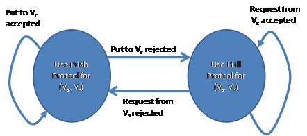

.. _Flow_Graph_Message_Passing_Protocol:

Flow Graph Basics: Message Passing Protocol
===========================================

|full_name| flow graph operates by passing
messages between nodes. A node may not be able to receive and process a
message from its predecessor. For a graph to operate most-efficiently,
if this occurs the state of the edge between the nodes can change its
state to pull so when the successor is able to handle a message it can
query its predecessor to see if a message is available. If the edge did
not reverse from push to pull, the predecessor node would have to
repeatedly attempt to forward its message until the successor accepts
it. This would consume resources needlessly.

Once the edge is in pull mode, when the successor is not busy, it will
try to pull a message from a predecessor.

#. If a predecessor has a message, the successor will process it and the
   edge will remain in pull mode.
#. If the predecessor has no message, the edge between the nodes will
   switch from pull to push mode.

The state diagram of this Push-Pull protocol is:

.. container:: fignone
   :name: basic_push_pull

   **The dynamic push / pull protocol.**

   .. container:: imagecenter

      |image0|

