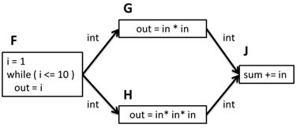
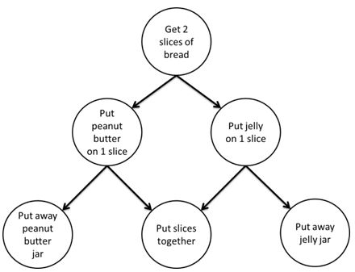

.. _Parallelizing_Flow_Graph:

Parallelizing Data Flow and Dependency Graphs
=============================================

In addition to loop parallelism, the |full_name| library also supports graph parallelism.
It's possible to create graphs that are highly scalable, but it is also possible to
create graphs that are completely sequential.

Using graph parallelism, computations are represented by nodes and the
communication channels between these computations are represented by
edges. When a node in the graph receives a message, a task is spawned to
execute its body object on the incoming message. Messages flow through
the graph across the edges that connect the nodes. The following
sections present two examples of applications that can be expressed as
graphs.

The following figure shows a *streaming* or *data flow* application
where a sequence of values is processed as each value passes through the
nodes in the graph. In this example, the sequence is created by a
function F. For each value in the sequence, G squares the value and H
cubes the value. J then takes each of the squared and cubed values and
adds them to a global sum. After all values in the sequence are
completely processed, sum is equal to the sum of the sequence of squares
and cubes from 1 to 10. In a streaming or data flow graph, the values
actually flow across the edges; the output of one node becomes the input
of its successor(s).

.. container:: fignone
   :name: simple_data_flow_title

   **Simple Data Flow Graph**

   .. container:: imagecenter

      |image0|

The following graphic shows a different form of graph application. In
this example, a dependence graph is used to establish a partial ordering
among the steps for making a peanut butter and jelly sandwich. In this
partial ordering, you must first get the bread before spreading the
peanut butter or jelly on the bread. You must spread on the peanut
butter before you put away the peanut butter jar, and likewise spread on
the jelly before you put away the jelly jar. And, you need to spread on
both the peanut butter and jelly before putting the two slices of bread
together. This is a partial ordering because, for example, it doesn't
matter if you spread on the peanut butter first or the jelly first. It
also doesn't matter if you finish making the sandwich before putting
away the jars.

.. container:: fignone
   :name: dependence_graph_make_sandwitch

   **Dependence Graph for Making a Sandwich**

   .. container:: imagecenter

      |image1|

While it can be inferred that resources, such as the bread, or the jelly
jar, are shared between ordered steps, it is not explicit in the graph.
Instead, only the required ordering of steps is explicit in a dependence
graph. For example, you must "Put jelly on 1 slice" **before** you "Put
away jelly jar".

The flow graph interface in the oneTBB library allows you to express
data flow and dependence graphs such as these, as well as more
complicated graphs that include cycles, conditionals, buffering and
more. If you express your application using the flow graph interface,
the runtime library spawns tasks to exploit the parallelism that is
present in the graph. For example, in the first example above, perhaps
two different values might be squared in parallel, or the same value
might be squared and cubed in parallel. Likewise in the second example,
the peanut butter might be spread on one slice of bread in parallel with
the jelly being spread on the other slice. The interface expresses what
is legal to execute in parallel, but allows the runtime library to
choose at runtime what will be executed in parallel.

The support for graph parallelism is contained within the namespace
``oneapi::tbb::flow`` and is defined in the ``flow_graph.h`` header file.

