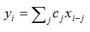

.. _Elementwise:

Elementwise
===========

.. container:: section

   .. rubric:: Problem
      :class: sectiontitle

   Initiate similar independent computations across items in a data set,
   and wait until all complete.

.. container:: section

   .. rubric:: Context
      :class: sectiontitle

   Many serial algorithms sweep over a set of items and do an
   independent computation on each item. However, if some kind of
   summary information is collected, use the Reduction pattern instead.

.. container:: section

   .. rubric:: Forces
      :class: sectiontitle

   No information is carried or merged between the computations.

.. container:: section

   .. rubric:: Solution
      :class: sectiontitle

   If the number of items is known in advance, use
   ``oneapi::tbb::parallel_for``. If not, consider using
   ``oneapi::tbb::parallel_for_each``.

   Use agglomeration if the individual computations are small relative
   to scheduler overheads.

   If the pattern is followed by a reduction on the same data, consider
   doing the element-wise operation as part of the reduction, so that
   the combination of the two patterns is accomplished in a single sweep
   instead of two sweeps. Doing so may improve performance by reducing
   traffic through the memory hierarchy.

.. container:: section

   .. rubric:: Example
      :class: sectiontitle

   Convolution is often used in signal processing. The convolution of a
   filter ``c`` and signal ``x`` is computed as:

   |image0|
   Serial code for this computation might look like:

   ::

      // Assumes c[0..clen-1] and x[1-clen..xlen-1] are defined
      for( int i=0; i<xlen+clen-1; ++i ) {
         float tmp = 0;
         for( int j=0; j<clen; ++j )
             tmp += c[j]*x[i-j];
         y[i] = tmp;
      }

   For simplicity, the fragment assumes that ``x`` is a pointer into an
   array padded with zeros such that ``x[k]``\ returns zero when ``k<0``
   or ``k≥xlen``.

   The inner loop does not fit the elementwise pattern, because each
   iteration depends on the previous iteration. However, the outer loop
   fits the elementwise pattern. It is straightforward to render it
   using ``oneapi::tbb::parallel_for`` as shown:

   ::

      oneapi::tbb::parallel_for( 0, xlen+clen-1, [=]( int i ) { 
         float tmp = 0;
         for( int j=0; j<clen; ++j )
             tmp += c[j]*x[i-j];
         y[i] = tmp;
      });

   ``oneapi::tbb::parallel_for`` does automatic agglomeration by implicitly
   using ``oneapi::tbb::auto_partitioner`` in its underlying implementation. If
   there is reason to agglomerate explicitly, use the overload of
   ``oneapi::tbb::parallel_for`` that takes an explicit range argument. The
   following shows the example transformed to use the overload.

   ::

      oneapi::tbb::parallel_for(
         oneapi::tbb::blocked_range<int>(0,xlen+clen-1,1000),
         [=]( oneapi::tbb::blocked_range<int> r ) { 
               int end = r.end();
             for( int i=r.begin(); i!=end; ++i ) {
                 float tmp = 0;
                 for( int j=0; j<clen; ++j )
                     tmp += c[j]*x[i-j];
                 y[i] = tmp;
             }
         }
      );

    

