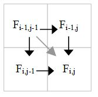

.. _Wavefront:

Wavefront
=========

.. container:: section

   .. rubric:: Problem
      :class: sectiontitle

   Perform computations on items in a data set, where the computation on
   an item uses results from computations on predecessor items.

.. container:: section

   .. rubric:: Context
      :class: sectiontitle

   The dependences between computations form an acyclic graph.

.. container:: section

   .. rubric:: Forces
      :class: sectiontitle

   -  Dependence constraints between items form an acyclic graph.

   -  The number of immediate predecessors in the graph is known in
      advance, or can be determined some time before the last
      predecessor completes.

.. container:: section

   .. rubric:: Solution
      :class: sectiontitle

   The solution is a parallel variant of topological sorting, using
   ``oneapi::tbb::parallel_for_each`` to process items. Associate an atomic
   counter with each item. Initialize each counter to the number of
   predecessors. Invoke ``oneapi::tbb::parallel_for_each`` to process the items that
   have no predessors (have counts of zero). After an item is processed,
   decrement the counters of its successors. If a successor's counter
   reaches zero, add that successor to the ``oneapi::tbb::parallel_for_each``
   via a "feeder".

   If the number of predecessors for an item cannot be determined in
   advance, treat the information "know number of predecessors" as an
   additional predecessor. When the number of predecessors becomes
   known, treat this conceptual predecessor as completed.

   If the overhead of counting individual items is excessive, aggregate
   items into blocks, and do the wavefront over the blocks.

.. container:: section

   .. rubric:: Example
      :class: sectiontitle

   Below is a serial kernel for the longest common subsequence
   algorithm. The parameters are strings ``x`` and ``y`` with respective
   lengths ``xlen`` and ``ylen``.

   ::

      int F[MAX_LEN+1][MAX_LEN+1];

      void SerialLCS( const char* x, size_t xlen, const char* y, size_t ylen )
      {
         for( size_t i=1; i<=xlen; ++i )
             for( size_t j=1; j<=ylen; ++j )
                 F[i][j] = x[i-1]==y[j-1] ? F[i-1][j-1]+1:
                                            max(F[i][j-1],F[i-1][j]);
      }

   The kernel sets ``F[i][j]`` to the length of the longest common
   subsequence shared by ``x[0..i-1]`` and ``y[0..j-1]``. It assumes
   that F[0][0..ylen] and ``F[0..xlen][0]`` have already been
   initialized to zero.

   The following figure shows the data dependences for calculating
   ``F[i][j]``.

   .. container:: fignone
      :name: fig3

      Data dependences for longest common substring calculation.
      |image0|

   The following figure shows the gray diagonal dependence is the
   transitive closure of other dependencies. Thus for parallelization
   purposes it is a redundant dependence that can be ignored.

   .. container:: fignone
      :name: fig4

      Diagonal dependence is redundant.
      |image1|

   It is generally good to remove redundant dependences from
   consideration, because the atomic counting incurs a cost for each
   dependence considered.

   Another consideration is grain size. Scheduling each ``F[i][j]``
   element calculation separately is prohibitively expensive. A good
   solution is to aggregate the elements into contiguous blocks, and
   process the contents of a block serially. The blocks have the same
   dependence pattern, but at a block scale. Hence scheduling overheads
   can be amortized over blocks.

   The parallel code follows. Each block consists of ``N×N`` elements.
   Each block has an associated atomic counter. Array ``Count``
   organizes these counters for easy lookup. The code initializes the
   counters and then rolls a wavefront using ``parallel_for_each``,
   starting with the block at the origin since it has no predecessors.

   ::

      const int N = 64;
      std::atomic<char> Count[MAX_LEN/N+1][MAX_LEN/N+1];
       

      void ParallelLCS( const char* x, size_t xlen, const char* y, size_t ylen ) {
         // Initialize predecessor counts for blocks.
         size_t m = (xlen+N-1)/N;
         size_t n = (ylen+N-1)/N;
         for( int i=0; i<m; ++i )
             for( int j=0; j<n; ++j )
                 Count[i][j] = (i>0)+(j>0);
         // Roll the wavefront from the origin.
         typedef pair<size_t,size_t> block;
         block origin(0,0);
         oneapi::tbb::parallel_for_each( &origin, &origin+1,
             [=]( const block& b, oneapi::tbb::feeder<block>&feeder ) {
                 // Extract bounds on block
                 size_t bi = b.first;
                 size_t bj = b.second;
                 size_t xl = N*bi+1;
                 size_t xu = min(xl+N,xlen+1);
                 size_t yl = N*bj+1;
                 size_t yu = min(yl+N,ylen+1);
                 // Process the block
                 for( size_t i=xl; i<xu; ++i )
                     for( size_t j=yl; j<yu; ++j )
                         F[i][j] = x[i-1]==y[j-1] ? F[i-1][j-1]+1:
                                                    max(F[i][j-1],F[i-1][j]);
                 // Account for successors
                 if( bj+1<n && --Count[bi][bj+1]==0 )
                     feeder.add( block(bi,bj+1) );
                 if( bi+1<m && --Count[bi+1][bj]==0 )
                     feeder.add( block(bi+1,bj) );       }
         );
      }

.. container:: section

   .. rubric:: References
      :class: sectiontitle

   Eun-Gyu Kim and Mark Snir, "Wavefront Pattern",
   http://snir.cs.illinois.edu/patterns/wavefront.pdf

.. |image0| image:: Images/image005a.jpg
   :width: 122px
   :height: 122px

