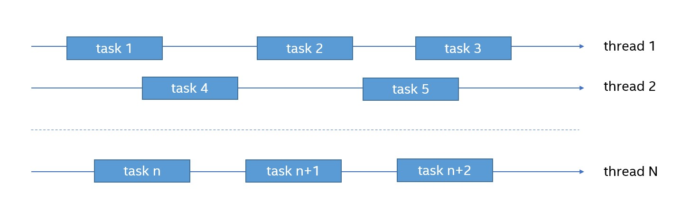

.. _intro:

What oneTBB Is 
==============

|full_name| is a runtime-based parallel programming model for C++ code that uses threads.
The template-based runtime library can help you harness the latent performance of multi-core processors.

oneTBB enables you to simplify parallel programming by breaking computation into parallel running tasks. Within a single process, 
parallelism is carried out through threads, an operating system mechanism that allows the same or different sets of instructions 
to be executed simultaneously. Using threads can make your program work faster and more efficiently.

Here you can see one of the possible executions of tasks by threads.

Use oneTBB to write scalable applications that:

* Specify logical parallel structure instead of threads.
* Emphasize data-parallel programming.
* Take advantage of concurrent collections and parallel algorithms.

oneTBB supports nested parallelism and load balancing. It means that you can use the library without worrying about oversubscribing a system, which happens when more tasks are assigned to a system than it can handle efficiently. 

oneTBB is used in different areas, such as scientific simulations, gaming, data analysis, etc. 

It is available as a stand-alone product and as part of the |base_tk|.
