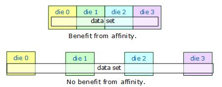

.. _Bandwidth_and_Cache_Affinity:

Bandwidth and Cache Affinity
============================

For a sufficiently simple function ``Foo``, the examples might not show
good speedup when written as parallel loops. The cause could be
insufficient system bandwidth between the processors and memory. In that
case, you may have to rethink your algorithm to take better advantage of
cache. Restructuring to better utilize the cache usually benefits the
parallel program as well as the serial program.

An alternative to restructuring that works in some cases is
``affinity_partitioner.`` It not only automatically chooses the
grainsize, but also optimizes for cache affinity and tries to distribute
the data uniformly among threads. Using ``affinity_partitioner`` can
significantly improve performance when:

-  The computation does a few operations per data access.

-  The data acted upon by the loop fits in cache.

-  The loop, or a similar loop, is re-executed over the same data.

-  There are more than two hardware threads available (and especially if
   the number of threads is not a power of two). If only two threads are
   available, the default scheduling in |full_name| 
   usually provides sufficient cache affinity.

The following code shows how to use ``affinity_partitioner``.

::

   #include "oneapi/tbb.h"
    

   void ParallelApplyFoo( float a[], size_t n ) {
       static affinity_partitioner ap;
       parallel_for(blocked_range<size_t>(0,n), ApplyFoo(a), ap);
   }
    

   void TimeStepFoo( float a[], size_t n, int steps ) {    
       for( int t=0; t<steps; ++t )
           ParallelApplyFoo( a, n );
   }

In the example, the ``affinity_partitioner`` object ``ap`` lives between
loop iterations. It remembers where iterations of the loop ran, so that
each iteration can be handed to the same thread that executed it before.
The example code gets the lifetime of the partitioner right by declaring
the ``affinity_partitioner`` as a local static object. Another approach
would be to declare it at a scope outside the iterative loop in
``TimeStepFoo``, and hand it down the call chain to ``parallel_for``.

If the data does not fit across the system’s caches, there may be little
benefit. The following figure shows the situations.

.. container:: fignone
   :name: fig3

   Benefit of Affinity Determined by Relative Size of Data Set and Cache
   |image0|

The next figure shows how parallel speedup might vary with the size of a
data set. The computation for the example is ``A[i]+=B[i]`` for ``i`` in
the range [0,N). It was chosen for dramatic effect. You are unlikely to
see quite this much variation in your code. The graph shows not much
improvement at the extremes. For small N, parallel scheduling overhead
dominates, resulting in little speedup. For large N, the data set is too
large to be carried in cache between loop invocations. The peak in the
middle is the sweet spot for affinity. Hence ``affinity_partitioner``
should be considered a tool, not a cure-all, when there is a low ratio
of computations to memory accesses.

.. container:: fignone
   :name: fig4

   Improvement from Affinity Dependent on Array Size
   |image1|

.. admonition:: Product and Performance Information 

   Performance varies by use, configuration and other factors. Learn more at `www.Intel.com/PerformanceIndex <https://www.intel.com/PerformanceIndex>`_.
   Notice revision #20201201

.. |image1| image:: Images/image008.jpg
   :width: 551px
   :height: 192px

