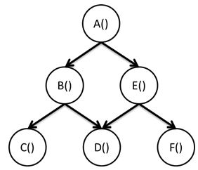
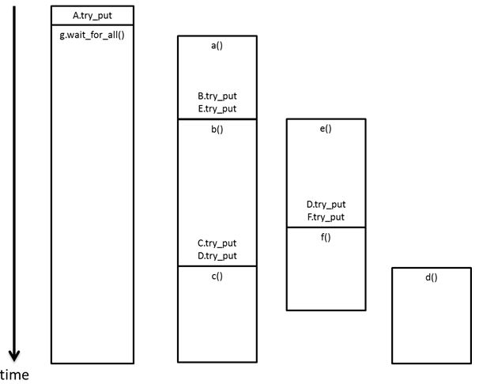

.. _Dependence_Graph:

Dependence Graph
================

In a dependence graph, the nodes invoke body objects to perform
computations and the edges create a partial ordering of these
computations. At runtime, the library spawns and schedules tasks to
execute the body objects when it is legal to do so according to the
specified partial ordering. The following figure shows an example of an
application that could be expressed using a dependence graph.

.. container:: fignone
   :name: dependence_graph_make_sandwitch

   Dependence Graph for Making a Sandwich

   .. container:: imagecenter

      |image0|

Dependence graphs are a special case of data flow graphs, where the data
passed between nodes are of type oneapi::tbb::flow::continue_msg. Unlike a
general data flow graph, nodes in a dependence graph do not spawn a task
for each message they receive. Instead, they are aware of the number of
predecessors they have, count the messages they receive and only spawn a
task to execute their body when this count is equal to the total number
of their predecessors.

The following figure shows another example of a dependence graph. It has
the same topology as the figure above, but with simple functions
replacing the sandwich making steps. In this partial ordering, function
A must complete executing before any other computation starts executing.
Function B must complete before C and D start executing; and E must
complete before D and F start executing. This is a partial ordering
because, for example, there is no explicit ordering requirement between
B and E or C and F.

.. container:: fignone
   :name: simple_dependence_graph

   Simple Dependence Graph

   .. container:: imagecenter

      |image1|

To implement this as a flow graph, continue_node objects are used for
the nodes and continue_msg objects as the messages. A continue_node
constructor takes two arguments:

::

   template< typename Body > continue_node( graph &g, Body body)

The first argument is the graph it belongs to and the second is a
function object or lambda expression. Unlike a function_node, a
continue_node is always assumed to have unlimited concurrency and will
immediately spawn a task whenever its dependencies are met.

The following code snippet is an implementation of the example in this
figure.

::

   typedef continue_node< continue_msg > node_t;
   typedef const continue_msg & msg_t;

   int main() {
     oneapi::tbb::flow::graph g;
     node_t A(g, { a(); } );
     node_t B(g, { b(); } );
     node_t C(g, { c(); } );
     node_t D(g, { d(); } );
     node_t E(g, { e(); } );
     node_t F(g, { f(); } );
     make_edge(A, B);
     make_edge(B, C);
     make_edge(B, D);
     make_edge(A, E);
     make_edge(E, D);
     make_edge(E, F);
     A.try_put( continue_msg() );
     g.wait_for_all();
     return 0;
   }

One possible execution of this graph is shown below. The execution of D
does not start until both B and E are finished. While a task is waiting
in the wait_for_all, its thread can participate in executing other tasks
from the oneTBB work pool.

.. container:: fignone

   Execution Timeline for a Dependence Graph

   .. container:: imagecenter

      |image2|

Again, it is important to note that all execution in the flow graph
happens asynchronously. The call to A.try_put returns control to the
calling thread quickly, after incrementing the counter and spawning a
task to execute the body of A. Likewise, the body tasks execute the
lambda expressions and then put a continue_msg to all successor nodes,
if any. Only the call to wait_for_all blocks, as it should, and even in
this case the calling thread may be used to execute tasks from the
oneTBB work pool while it is waiting.

The above timeline shows the sequence when there are enough threads to
execute all of the tasks that can be executed concurrently in parallel.
If there are fewer threads, then some tasks that are spawned will need
to wait until a thread is available to execute them.

.. |image0| image:: Images/flow_graph_complex.jpg
   :width: 440px
   :height: 337px

