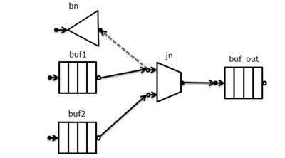
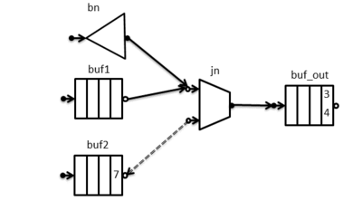

.. _Flow_Graph_Reservation:

Flow Graph Basics: Reservation
==============================

|full_name| flow graph
``join_node`` has four possible policies: ``queueing``, ``reserving``,
``key_matching`` and ``tag_matching``. ``join_nodes`` need messages at
every input before they can create an output message. The reserving
``join_node`` does not have internal buffering, and it does not pull
messages from its inputs until it has a message at each input. To create
an output message it temporarily reserves a message at each input port,
and only if all input ports succeed reserving messages will an output
message be created. If any input port fails to reserve a message, no
message will be pulled by the ``join_node``.

To support the reserving ``join_node`` some nodes support
**reservation** of their outputs. The way reservation works is:

-  When a node connected to a reserving ``join_node`` in push state
   tries to push a message, the ``join_node`` always rejects the push
   and the edge connecting the nodes is switched to pull mode.
-  The reserving input port calls ``try_reserve`` on each edge in pull
   state. This may fail; if so, the reserving input port switches that
   edge to push state, and tries to reserve the next node connected by
   an edge in pull state. While the input port's predecessor is in
   reserved state, no other node can retrieve the reserved value.
-  If each input port successfully reserves an edge in pull state, the
   reserving ``join_node`` will create a message using the reserved
   messages and try to push the resulting message to any nodes connected
   to it.
-  If the message is successfully pushed to a successor, the
   predecessors that were reserved are signaled that the messages were
   used (by calling ``try_consume()``.) Those messages will be discarded
   by the predecessor nodes, because they have been successfully pushed.
-  If the message was not successfully pushed to any successor, the
   predecessors that were reserved are signaled that the messages were
   not used (by calling ``try_release()``.) At this point, the messages
   may be pushed to or pulled by other nodes.

Because the reserving ``join_node`` will only attempt to push when each
input port has at least one edge in a pull state, and will only attempt
to create and push a message if all input ports succeed reserving
messages, at least one of the predecessors to each of the reserving
``join_node`` input ports must be reservable.

The following example demonstrates a reserving ``join_node``'s behavior.
``buffer_nodes`` buffer their output, so they accept a switch of their
output edge from push to pull mode. ``broadcast_nodes`` do not buffer
messages and do not support ``try_get()`` or ``try_reserve()``.

::

   void run_example2() {  // example for Flow_Graph_Reservation.xml
       graph g;
       broadcast_node<int> bn(g);
       buffer_node<int> buf1(g);
       buffer_node<int> buf2(g);
       typedef join_node<tuple<int,int>, reserving> join_type;
       join_type jn(g);
       buffer_node<join_type::output_type> buf_out(g);
       join_type::output_type tuple_out;
       int icnt;

       // join_node predecessors are both reservable buffer_nodes
       make_edge(buf1,input_port<0>(jn));
       make_edge(bn,input_port<0>(jn));      // attach a broadcast_node
       make_edge(buf2,input_port<1>(jn));
       make_edge(jn, buf_out);
       bn.try_put(2);
       buf1.try_put(3);
       buf2.try_put(4);
       buf2.try_put(7);
       g.wait_for_all();
       while (buf_out.try_get(tuple_out)) {
           printf("join_node output == (%d,%d)\n",get<0>(tuple_out), get<1>(tuple_out) );
       }
       if(buf1.try_get(icnt)) printf("buf1 had %d\n", icnt);
       else printf("buf1 was empty\n");
       if(buf2.try_get(icnt)) printf("buf2 had %d\n", icnt);
       else printf("buf2 was empty\n");
   }

In the example above, port 0 of the reserving ``join_node`` ``jn`` has
two predecessors: a ``buffer_node`` ``buf1`` and a ``broadcast_node``
``bn``. Port 1 of the ``join_node`` has one predecessor, ``buffer_node``
``buf2``.

.. container:: fignone
   :name: reserve_step1

   .. container:: imagecenter

      |image0|

We will discuss one possible execution sequence (the scheduling of tasks
may differ slightly, but the end result will be the same.)

::

       bn.try_put(2);

``bn`` attempts to forward 2 to ``jn``. ``jn`` does not accept the value
and the arc from ``bn`` to ``jn`` reverses. Because neither bn nor jn
buffer messages, the message is dropped. Because not all the inputs to
``jn`` have available predecessors, ``jn`` does nothing further.

.. CAUTION:: 
   Any node which does not support reservation will not work correctly
   when attached to a reserving ``join_node``. This program demonstrates
   why this occurs; connecting non-reserving nodes to nodes requiring
   support for reservation is **not** recommended practice.

.. container:: fignone
   :name: reserve_step2

   .. container:: imagecenter

      |image1|

::

       buf1.try_put(3);

``buf1`` attempts to forward 3 to ``jn``. ``jn`` does not accept the
value and the arc from ``buf1`` to ``jn`` reverses. Because not all the
inputs to ``jn`` have available predecessors, ``jn`` does nothing
further.

.. container:: fignone
   :name: reserve_step3

   .. container:: imagecenter

      |image2|

::

       buf2.try_put(4);

``buf2`` attempts to forward 4 to ``jn``. ``jn`` does not accept the
value and the arc from ``buf2`` to ``jn`` reverses. Now both inputs of
``jn`` have predecessors, a task to build and forward a message from
``jn`` will be spawned. We assume that task is not yet executing.

.. container:: fignone
   :name: reserve_step4

   .. container:: imagecenter

      |image3|

::

       buf2.try_put(7);

``buf2`` has no successor (because the arc to ``jn`` is reversed,) so it
stores the value 7.

.. container:: fignone
   :name: reserve_step5

   .. container:: imagecenter

      |image4|

Now the task spawned to run ``jn`` runs.

-  ``jn`` tries to reserve ``bn``, which fails. The arc to ``bn``
   switches back to the forward direction.
-  ``jn`` tries to reserve ``buf1``, which succeeds (reserved nodes are
   colored grey.) ``jn`` receives the value 3 from ``buf1``, but it
   remains in ``buf1`` (in case the attempt to forward a message from
   ``jn`` fails.)
-  ``jn`` tries to reserve ``buf2``, which succeeds. ``jn`` receives the
   value 4 from ``buf2``, but it remains in ``buf2``.
-  ``jn`` constructs the output message ``tuple<3,4>``.

.. container:: fignone
   :name: reserve_step6

   .. container:: imagecenter

      |image5|

Now ``jn`` pushes its message to ``buf_out``, which accepts it. Because
the push succeeded, ``jn`` signals ``buf1`` and ``buf2`` that the
reserved values were used, and the buffers discard those values. Now
``jn`` attempts to reserve again.

-  No attempt to pull from ``bn`` is made, because the edge from ``bn``
   to ``jn`` is in push state.
-  ``jn`` tries to reserve ``buf1``, which fails. The arc to ``buf1``
   switches back to the forward direction.
-  ``jn`` does not try any further actions.

.. container:: fignone
   :name: reserve_step7

   .. container:: imagecenter

      |image6|

No further activity occurs in the graph, and the ``wait_for_all()`` will
complete. The output of this code is

::

   join_node output == (3,4)
   buf1 was empty
   buf2 had 7

.. |image2| image:: Images/flow_graph_reserve_buffers_3.png
   :width: 400px
   :height: 222px
.. |image3| image:: Images/flow_graph_reserve_buffers_4.png
   :width: 400px
   :height: 222px
.. |image4| image:: Images/flow_graph_reserve_buffers_5.png
   :width: 400px
   :height: 222px
.. |image5| image:: Images/flow_graph_reserve_buffers_6.png
   :width: 400px
   :height: 222px

