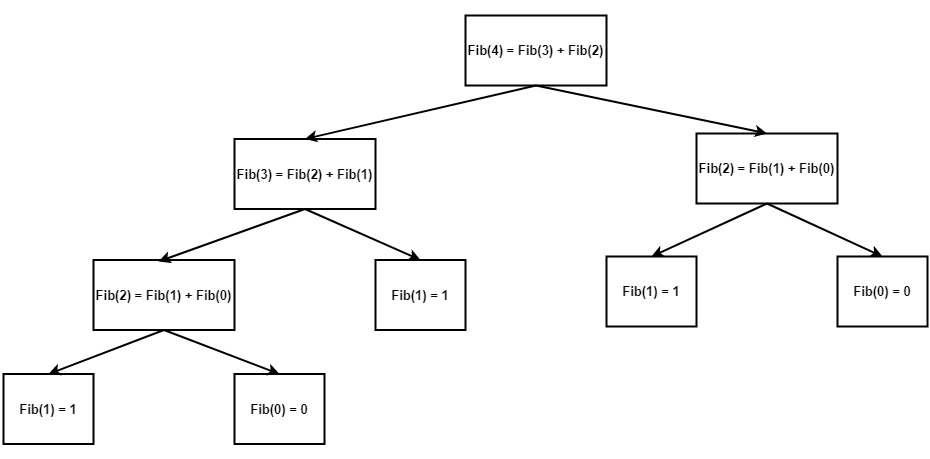
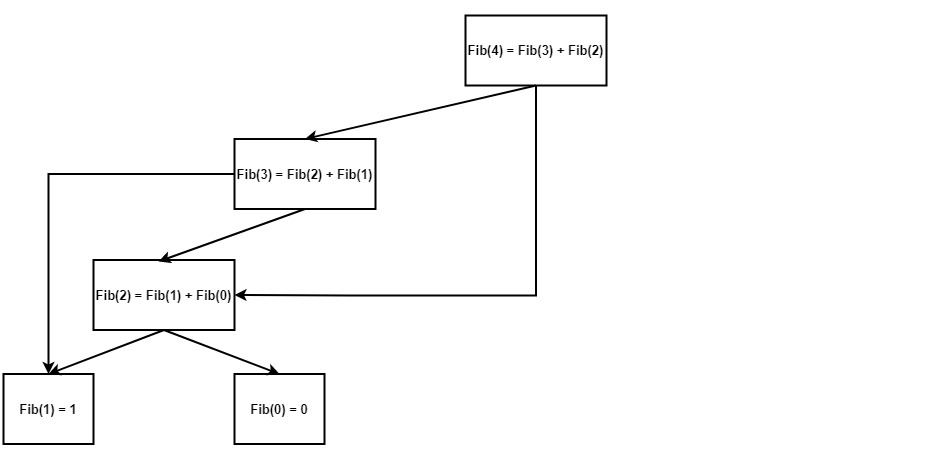

.. _Lazy_Initialization:

Lazy Initialization
==================

.. container:: section

   .. rubric:: Problem
      :class: sectiontitle

   Delay the creation of an object, potentially expensive, until it is accessed.
   In parallel programming, initialization must also be guarded against race conditions.

.. container:: section

   .. rubric:: Context
      :class: sectiontitle

   The cost of operations that take place during the initialization
   of the object may be considerably high. In that case, the object
   should be initialized only when needed. Lazy initialization is
   the common tactic that allows implementing such an approach.

.. container:: section

   .. rubric:: Solution
      :class: sectiontitle

   Using ``oneapi::tbb::collaborative_call_once`` with ``oneapi::tbb::collaborative_once_flag``
   helps to implement thread-safe lazy initialization for a user object.

   In addition, ``collaborative_call_once`` allows other thread blocked on
   the same ``collaborative_once_flag`` to join other |short_name|
   parallel constructions called within the initializing function.

.. container:: section

   .. rubric:: Example
      :class: sectiontitle

   This example illustrates the implementation of lazy initialization
   for the calculation of the Fibonacci numbers. Here is a graphical
   representation of the Fibonacci recursion tree for N=4.

   |image0|

   As seen in the diagram, some elements are recalculated more than once. These operations are redundant,
   so the "lazy initialized" Fibonacci numbers are relevant here.

   An implementation without the use of lazy initialization would have *O(2^N)* time complexity due to
   the full recursion tree traversal and recalculation of values. Since all the nodes are traversed once,
   the tree becomes a list, making the time complexity *O(N)*.

   |image1|

   Here you can see the code for the implementation. Already calculated values are stored in a buffer
   paired with ``collaborative_once_flag`` and will not be recalculated when ``collaborative_call_once``
   is invoked when initialization has already been done.

   ::

      using FibBuffer = std::vector<std::pair<oneapi::tbb::collaborative_once_flag, std::uint64_t>>;

      std::uint64_t LazyFibHelper(int n, FibBuffer& buffer) {
         // Base case
         if (n <= 1) {
            return n;
         }
         // Calculate nth value only once and store it in the buffer.
         // Other threads won't be blocked on already taken collaborative_once_flag
         // but join parallelism inside functor
         oneapi::tbb::collaborative_call_once(buffer[n].first, [&]() {
            std::uint64_t a, b;
            oneapi::tbb::parallel_invoke([&] { a = LazyFibHelper(n - 2, buffer); },
                                         [&] { b = LazyFibHelper(n - 1, buffer); });
            buffer[n].second = a + b;
         });

         return buffer[n].second;
      }

      std::uint64_t Fib(int n) {
         FibBuffer buffer(n+1);
         return LazyFibHelper(n, buffer);
      }

