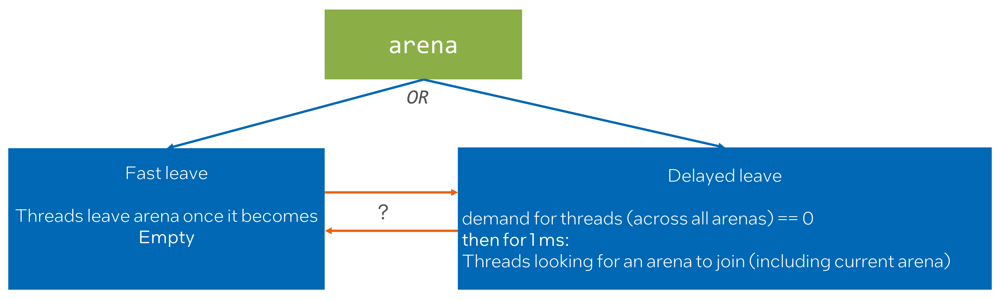
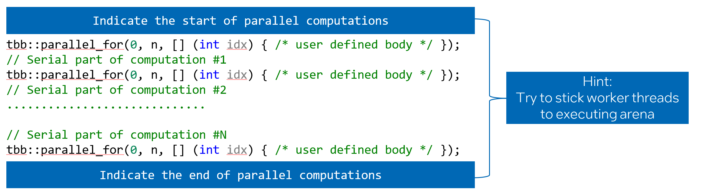
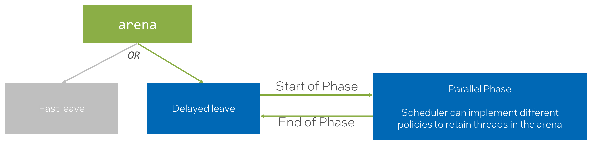
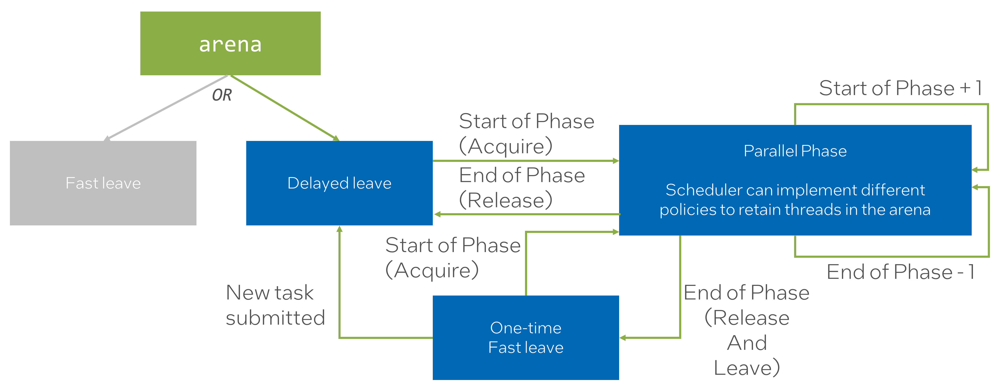
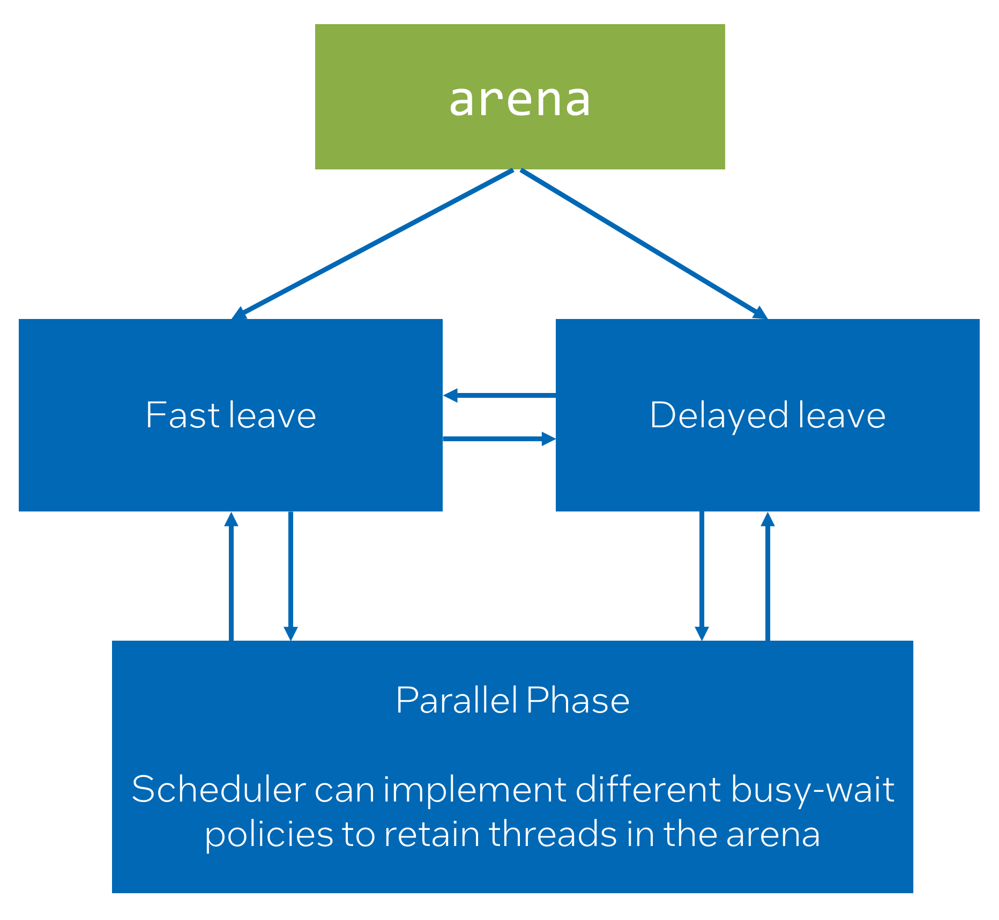
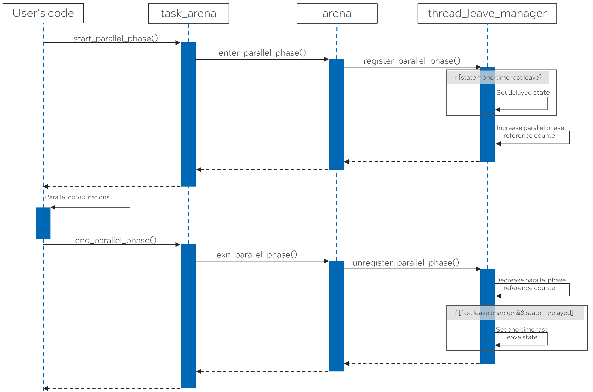

# Adding API for parallel phase to task_arena to warm-up/retain/release worker threads

## Introduction

In oneTBB, there has never been an API that allows users to block worker threads within the arena.
This design choice was made to preserve the composability of the application.
Before PR#1352, workers moved to the thread pool to sleep once there were no arenas with active
demand. However, PR#1352 introduced a delayed leave behavior to the library that
results in blocking threads for an _implementation-defined_ duration inside an arena
if there is no active demand arcoss all arenas. This change significantly
improved performance for various applications on high thread count systems.
The main idea is that usually, after one parallel computation ends,
another will start after some time. The delayed leave behavior is a heuristic to utilize this,
covering most cases within _implementation-defined_ duration.

However, the new behavior is not the perfect match for all the scenarios:
* The heuristic of delayed leave is unsuitable for the tasks that are submitted
  in an unpredictable pattern and/or durations.
* If oneTBB is used in composable scenarios it is not behaving as
  a good citizen consuming CPU resources.
  * For example, if an application runs a series of stages where oneTBB is used for one stage
    and OpenMP is used for a subsequent stage, there is a chance that oneTBB workers will
    interfere with OpenMP threads. This interference might result in slight oversubscription,
    which in turn might lead to underperformance.

So there are two related problems but with different resolutions:
* Completely disable new behavior for scenarios where the heuristic of delayed leave is unsuitable.
* Optimize library behavior so customers can benefit from the heuristic of delayed leave but
  make it possible to indicate that "it is the time for the TBB arena to release threads".

## Proposal

Let's tackle these problems one by one.

### Completely disable new behavior

Let’s consider both “Delayed leave” and “Fast leave” as 2 different states in state machine.<br>
* The "Delayed leave" heuristic benefits most of the workloads. Therefore, this is the 
  default behavior for arena. 
* Workloads that has rather negative performance impact from the heuristic of delayed leave
  can create an arena in “Fast leave” state.



There will be a question that we need to answer:
* Do we see any value if arena potentially can transition from one to another state?

To answer this question, the following scenarios should be considered:
* What if different types of workloads are mixed in one application?
* Different types of arenas can be used for different types of workloads.

### When threads should leave?

oneTBB itself can only guess when the ideal time to release threads from the arena is.
Therefore, it does its best effort to preserve and enhance performance without completely
messing up composability guarantees (that is how delayed leave is implemented).

As we already discussed, there are cases where it does not work perfectly,
therefore customers that want to further optimize this
aspect of oneTBB behavior should be able to do it.

This problem can be considered from another angle. Essentially, if the user can indicate
where parallel computation ends, they can also indicate where it starts.



With this approach, the user not only releases threads when necessary but also specifies a
programmable block where worker threads should expect new work coming regularly
to the executing arena.

Let’s add a new state to the existing state machine. To represent "Parallel Phase" state.

> **_NOTE:_** The "Fast leave" state is colored Grey just for simplicity of the chart.
              Let's assume that arena was created with the "Delayed leave". 
              The logic demonstrated below is applicable to the "Fast leave" as well.



This state diagram leads to several questions:
* What if there are multiple Parallel Phases?
* If “End of Parallel Phase” leads back to “Delayed leave” how soon will threads
  be released from arena?
  * What if we indicated that threads should leave arena after the "Parallel Phase"?
  * What if we just indicated the end of the "Parallel Phase"?

The extended state machine aims to answer these questions.
* The first call to the “Start of Phase” will transition into the “Parallel Phase” state.
* The last call to the “End of Phase” will transition back to the “Delayed leave” state
  or into the "One-time Fast leave" if it is indicated that threads should leave sooner.
* Concurrent or nested calls to the “Start of Phase” or the “End of Phase”
  increment/decrement a reference counter.



Let's consider the semantics that an API for explicit parallel phases can provide:
* Start of a parallel phase:
  * Indicates the point from which the scheduler can use a hint and keep threads in the arena
    for longer.
  * Serves as a warm-up hint to the scheduler:
    * Allows reducing delays of computation start by initiating the wake-up of worker threads
      in advance.
* "Parallel phase" itself:
  * Scheduler can implement different policies to retain threads in the arena.
    * For instance, more aggressive policy might be implemented for _parallel phase_.
      It can be beneficial in cases when the default arena leave policy is not sufficient enough.
  * The semantics for retaining threads is a hint to the scheduler;
    thus, no real guarantee is provided. The scheduler can ignore the hint and
    move threads to another arena or to sleep if conditions are met.
* End of a parallel phase:
  * Indicates the point from which the scheduler may drop the hint and
    no longer retain threads in the arena.
  * Indicates that worker threads should avoid busy-waiting once there is no more work in the arena.
    * Temporarily overrides the default arena leave policy, which will be restored when
      new work is submitted.


### Proposed API

Summary of API changes:

* Add enumeration class for the arena leave policy.
* Add the policy as the last parameter to the arena constructor and initializer
defaulted to "automatic".
* Add functions to start and end the parallel phase to the `task_arena` class
and the `this_task_arena` namespace.
* Add RAII class to map a parallel phase to a code scope.

```cpp
class task_arena {
    enum class leave_policy : /* unspecified type */ {
        automatic = /* unspecifed */,
        fast = /* unspecifed */,
    };

    task_arena(int max_concurrency = automatic, unsigned reserved_for_masters = 1,
               priority a_priority = priority::normal,
               leave_policy a_leave_policy = leave_policy::automatic);

    task_arena(const constraints& constraints_, unsigned reserved_for_masters = 1,
               priority a_priority = priority::normal,
               leave_policy a_leave_policy = leave_policy::automatic);

    void initialize(int max_concurrency, unsigned reserved_for_masters = 1,
                    priority a_priority = priority::normal,
                    leave_policy a_leave_policy = leave_policy::automatic);

    void initialize(constraints a_constraints, unsigned reserved_for_masters = 1,
                    priority a_priority = priority::normal,
                    leave_policy a_leave_policy = leave_policy::automatic);

    void start_parallel_phase();
    void end_parallel_phase(bool with_fast_leave = false);

    class scoped_parallel_phase {
        scoped_parallel_phase(task_arena& ta, bool with_fast_leave = false);
    };
};

namespace this_task_arena {
    void start_parallel_phase();
    void end_parallel_phase(bool with_fast_leave = false);
}
```
The _parallel phase_ continues until each previous `start_parallel_phase` call
to the same arena has a matching `end_parallel_phase` call.<br>
Let's introduce RAII scoped object that will help to manage the contract.

If the end of the parallel phase is not indicated by the user, it will be done automatically when
the last public reference is removed from the arena (i.e., task_arena has been destroyed or,
for an implicitly created arena, the thread that owns it has completed).
This ensures correctness is preserved (threads will not be retained forever).

### Examples

Following code snippets show how the new API can be used.

```cpp
void task_arena_leave_policy_example() {
    tbb::task_arena ta{tbb::task_arena::automatic, 1, priority::normal, leave_policy::fast};
    ta.execute([]() {
        // Parallel computation
    });
    // Different parallel runtime is used
    // so it is preferred that worker threads won't be retained
    // in the arena at this point.
    #pragma omp parallel for
    for (int i = 0; i < work_size; ++i) {
        // Computation
    }
}

void parallel_phase_example() {
    tbb::this_task_arena::start_parallel_phase();
    tbb::parallel_for(0, work_size, [] (int idx) {
        // User defined body
    });

    // Some serial computation

    tbb::parallel_for(0, work_size, [] (int idx) {
        // User defined body
    });
    tbb::this_task_arena::end_parallel_phase(/*with_fast_leave=*/true);

    // Different parallel runtime (for example, OpenMP) is used
    // so it is preferred that worker threads won't be retained
    // in the arena at this point.
    #pragma omp parallel for
    for (int i = 0; i < work_size; ++i) {
        // Computation
    }
}

void scoped_parallel_phase_example() {
    tbb::task_arena ta{/*arena constraints*/};
    {
        // Start of the parallel phase
        tbb::task_arena::scoped_parallel_phase phase{ta, /*with_fast_leave=*/true};
        ta.execute([]() {
            // Parallel computation
        });

        // Serial computation

        ta.execute([]() {
            // Parallel computation
        });
    } // End of the parallel phase

    // Different parallel runtime (for example, OpenMP) is used
    // so it is preferred that worker threads won't be retained
    // in the arena at this point.
    #pragma omp parallel for
    for (int i = 0; i < work_size; ++i) {
        // Computation
    }
}
```

## Considerations

The alternative approaches were also considered.<br>
We can express this state machine as complete graph and provide low-level interface that
will give control over state transition.



We considered this approach too low-level. Plus, it leaves a question: "How to manage concurrent changes of the state?".

The retaining of worker threads should be implemented with care because
it might introduce performance problems if:
* Threads cannot migrate to another arena because they are
  retained in the current arena.
* Compute resources are not homogeneous, e.g., the CPU is hybrid.
  Heavier involvement of less performant core types might result in artificial work
  imbalance in the arena.

## Technical Details

To implement the proposed feature, the following changes were made:
* Added a new entity `thread_leave_manager` to the `r1::arena` which is responsible for
  for managing the state of workers' arena leaving behaviour.
* Introduced two new entry points to the library.
  * `r1::enter_parallel_phase(d1::task_arena_base*, std::uintptr_t)` - used to communicate
    the start of parallel phase with the library.
  * `r1::exit_parallel_phase(d1::task_arena_base*, std::uintptr_t)` - used to communicate
    the end of parallel phase with the library.

### Thread Leave Manager

`thread_leave_manager` class implements the state machine described in proposal.
Specifically, it controls when worker threads are allowed to be retained in the arena.
`thread_leave_manager` is initialized with a state that determines the default
behavior for workers leaving the arena.

To support `start/end_parallel_phase` API, it provides functionality to override the default
state with a "Parallel Phase" state. It also keeps track of the number of active parallel phases.

The following sequence diagram illustrates the interaction between the user and
the `thread_leave_manager` during the execution of parallel phases. It shows how the
`thread_leave_manager` manages the state transitions when using `start/end_parallel_phase`.



## Open Questions in Design

Some open questions that remain:
* Are the suggested APIs sufficient?
  * In the current version of proposed API, the `scoped_parallel_phase` object can be created
    only for already existing `task_arena`. Should it be possible for `this_task_arena` as well?
  * What should be expected from "Parallel Phase" API for `this_task_arena` when a calling thread
    doesn't yet have any associated arena?
  * Should parallel phase API be limited only to RAII-only style?
    * Are there any scenarios where inconvenience of handling `scoped_parallel_phase` object is
      not acceptable?
* Are there additional use cases that should be considered that we missed in our analysis?
* Do we see any value if arena potentially can transition from one to another state?
  * What if different types of workloads are mixed in one application?
  * What if there concurrent calls to this API?

## Conditions to become fully supported

Following conditions need to be met for the feature to move from experimental to fully supported:
* Open questions regarding API should be resolved.
* The feature should demonstrate performance improvements in scenarios mentioned.
* oneTBB specification needs to be updated to reflect the new feature.
